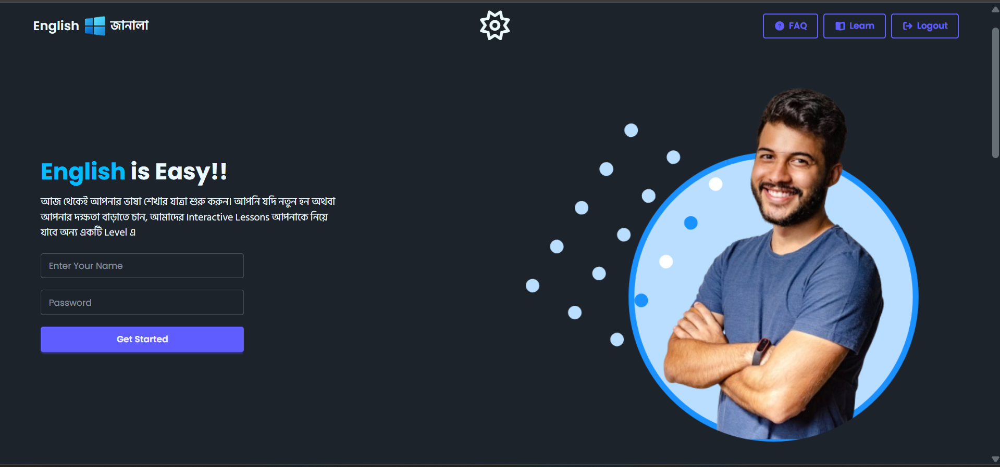

  

🚀 English Janala – Interactive Vocabulary Learning App

      

📘 Project Overview

English Janala একটি Fully Interactive Vocabulary Learning Web Application যেখানে ব্যবহারকারীরা Lesson অনুযায়ী শব্দ শিখতে পারে, শব্দের বিস্তারিত দেখতে পারে, উচ্চারণ শুনতে পারে এবং Dark Mode ব্যবহার করতে পারে।

এই প্রজেক্টে Live API ব্যবহার করে Dynamic UI তৈরি করা হয়েছে এবং পুরো অ্যাপ Async JavaScript দিয়ে পরিচালিত।

🌐 Live Demo 

🔗 Live Site: https://kamalcodezen.github.io/english-janala-vocabulary-app/

✨ Core Features

🔹 Dynamic Lesson Buttons from API
🔹 Words Load Based on Selected Level
🔹 Active Button Highlight System
🔹 Loading Spinner (UI State Management)
🔹 Search Functionality (Real-Time Filter)
🔹 Word Details Modal (API-Based)
🔹 Synonyms Auto Render
🔹 Voice Pronunciation (Web Speech API)
🔹 Dark Mode Toggle (LocalStorage Support)
🔹 Fully Responsive Design

🎯 Advanced Functionalities

✔ Async/Await API Handling
✔ Clean DOM Manipulation
✔ Reusable Functions
✔ Error & Empty State Handling
✔ LocalStorage Data Persistence
✔ UI Toggle State Management

🛠 Technologies Used

HTML5

Tailwind CSS

DaisyUI

JavaScript (ES6+)

Fetch API

Async / Await

REST API

Local Storage

Web Speech API

📡 API Endpoints
Get All Levels
https://openapi.programming-hero.com/api/levels/all

Get Words by Level
https://openapi.programming-hero.com/api/level/{id}

Get Word Details
https://openapi.programming-hero.com/api/word/{id}

Get All Words
https://openapi.programming-hero.com/api/words/all
📂 Project Structure
📁 english-janala
 ├── index.html
 ├── styles/
 │   └── style.css
 ├── scripts/
 │   └── app.js
 └── assets/
📸 Project Preview

(Add your project screenshots here)

💡 What I Learned From This Project

✅ API Integration in Real Projects
✅ Managing UI State with Spinner
✅ Handling Falsy / Invalid Data
✅ Writing Modular JavaScript Code
✅ Dark Mode Implementation
✅ Voice Feature Integration

🚀 Future Improvements

Save Word Feature

Performance Optimization

Animation Enhancement

Authentication System

Deployment with Custom Domain

👨‍💻 Developer

Sk KamalUddin
Frontend Developer | JavaScript Enthusiast 

📍 New Delhi, India
📧 kamaluddin7908@gmail.com

🔗 LinkedIn: www.linkedin.com/in/sk-kamaluddin

🔗 GitHub: https://github.com/kamalcodezen

 ⭐ If you like this project, give it a star and feel free to fork it! 

